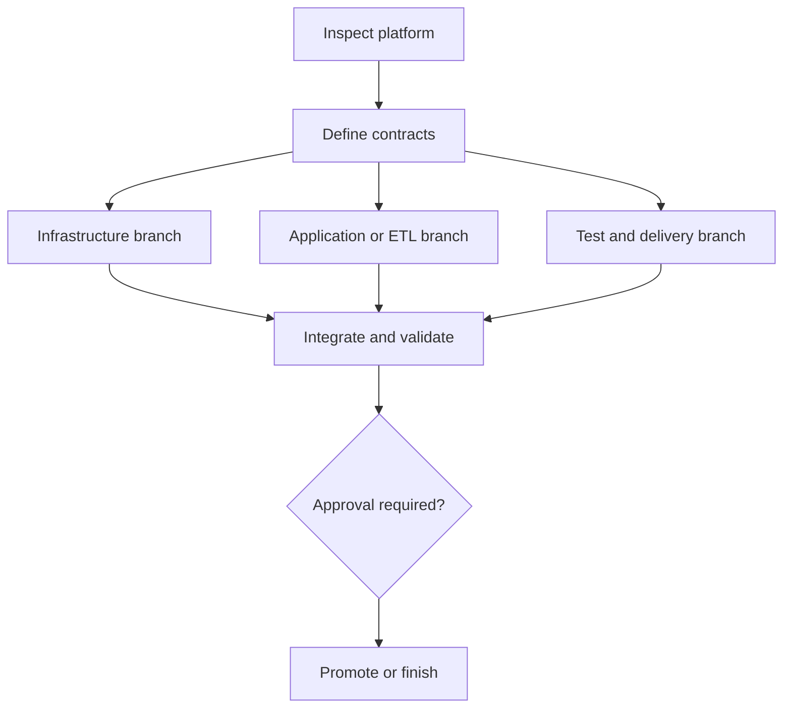

# Graph Engineering

Use this skill for software-development tasks involving implementation, debugging, refactoring, migration, testing, architecture, documentation, configuration, infrastructure, security, performance, or repository analysis.

The purpose of this skill is to transform work into a dependency graph instead of treating it as one large linear task.

## Core operating rule

For each non-trivial task:

1. Understand the requested outcome.
2. Inspect the repository and relevant files.
3. Convert the work into a directed task graph.
4. Identify dependencies, independent branches, risks, validation nodes, and approval gates.
5. Execute only nodes whose dependencies are satisfied.
6. Validate every completed implementation node.
7. Update the graph when new information is discovered.
8. Finish only when the final acceptance node passes.

Quality means correct understanding, focused implementation, and credible evidence. It does not mean producing the largest graph, running unrelated checks, or adding approval gates that do not reduce real risk.

## Proportional rigor

Choose the lightest operating mode that still controls the task's actual risk.

### Quick mode

Use for small, isolated, reversible, low-risk work such as a typo, a clear configuration correction, a narrow test update, or a localized code change with known behavior.

- Keep a one-to-three-node graph internally.
- Inspect only the context needed to avoid a blind edit.
- Make the change directly and run the smallest decisive validation.
- Do not require a displayed graph, formal contract, or approval gate unless the user requests one.

### Standard mode

Use for most multi-file changes, service behavior, non-production infrastructure code, Glue or PySpark logic, Lambda changes, and database query or schema work that is not being executed against production.

- Present a concise graph when it helps coordination or exposes dependencies.
- Define contracts for shared interfaces, data schemas, and cross-component behavior.
- Run targeted tests plus relevant build, static, plan, or integration checks.
- Continue through ready nodes without repeatedly asking for confirmation.

### Controlled mode

Use when the requested action can affect production, persistent state, sensitive data, access control, network exposure, compatibility, availability, significant cost, or difficult-to-reverse infrastructure.

- Show the important graph, critical path, validation nodes, and rollback path.
- Use explicit contracts and environment boundaries.
- Require approval only at the point where an authorized but consequential action would actually occur.
- Preserve evidence from plans, tests, scans, reconciliation, smoke checks, and deployment results.

Escalate to a stricter mode when discovery reveals higher risk. Downgrade when evidence shows the scope is safer than initially assumed. Briefly explain a material mode change.

Prefer the simplest graph that exposes real dependencies and failure boundaries. Do not create all graph views, node types, validation categories, or platform branches unless they are relevant.

## Graph model

Represent the task as:

\[
G = (V, E)
\]

Where:

- `V` is the set of task nodes.
- `E` is the set of directed dependency edges.
- An edge `A -> B` means B cannot begin until A is complete.
- A node is `READY` only when all required predecessor nodes are complete.
- A node is `BLOCKED` when one or more required dependencies are incomplete.
- A node is `DONE` only after its acceptance criteria pass.

The graph should be a directed acyclic graph whenever possible.

If a cycle exists, identify it and restructure the work by introducing an interface, contract, mock, migration stage, temporary adapter, or explicit coordination node.

## Enterprise platform graph views

For infrastructure or data-platform work, maintain the relevant connected views instead of forcing every dependency into one diagram:

1. **Infrastructure graph** — Terraform/EAC modules, state, providers, accounts, environments, IAM, VPCs, subnets, security groups, endpoints, S3, ECR, Lambda, Glue, databases, and other provisioned resources.
2. **Data-flow graph** — sources, events, datasets, S3 zones, schemas, transformations, Glue or PySpark jobs, quality checks, destinations, and replay paths.
3. **Delivery graph** — source changes, Java/Python builds, tests, artifacts or images, scans, Terraform plans, Jules/Jenkins stages, deployments, promotion, smoke tests, and rollback.

Connect the views with explicit cross-graph edges. Examples:

- an ECR image must exist before a Lambda or job deployment can reference its digest;
- IAM, networking, and endpoints must exist before a Glue job can reach S3 or a database;
- a schema contract must be approved before producers, transformations, and consumers change;
- a successful plan, test, and scan must precede environment promotion.

Label edges as `CONTROL`, `DATA`, `SECURITY`, `SCHEMA`, or `DELIVERY` when the distinction prevents ambiguity. Separate orchestration order from actual data movement.

## Node types

Use the following node types as needed.

### Discovery node

Used to inspect code, configuration, logs, schemas, tests, documentation, interfaces, dependencies, or runtime behavior.

### Decision node

Used when multiple valid approaches exist and a technical choice must be made.

Document:

- available options;
- tradeoffs;
- selected option;
- selection rationale.

### Contract node

Defines an interface, API, schema, event, type, invariant, acceptance condition, or boundary that downstream nodes depend on.

### Implementation node

Creates or modifies code, configuration, infrastructure, documentation, or tests.

### Validation node

Independently verifies an implementation node.

Examples include:

- compilation;
- static analysis;
- unit tests;
- integration tests;
- regression tests;
- schema validation;
- security checks;
- runtime verification;
- performance measurement;
- manual inspection.

### Integration node

Combines independently implemented branches and verifies that their contracts remain compatible.

### Approval node

Requires human confirmation before an irreversible, destructive, expensive, security-sensitive, production-facing, or major architectural action.

### Final acceptance node

Confirms that the original request and all acceptance criteria have been satisfied.

## Required planning process

Before making meaningful changes, perform the following process.

### 1. Understand the objective

Determine:

- the requested outcome;
- explicit requirements;
- implied requirements;
- repository constraints;
- affected components;
- expected behavior;
- failure conditions;
- acceptance criteria.

Do not invent requirements that materially change the user's intent.

### 2. Inspect before editing

Inspect enough of the repository to understand:

- project structure;
- relevant source files;
- existing conventions;
- tests;
- build and execution commands;
- dependency boundaries;
- related implementations;
- configuration and deployment impact.

Do not assume filenames, APIs, frameworks, commands, or architecture when they can be verified from the workspace.

### 3. Build the task graph

Create nodes that are:

- independently understandable;
- independently verifiable;
- limited in scope;
- connected only by real dependencies;
- large enough to avoid unnecessary fragmentation;
- small enough to isolate failures.

Each node must include:

- ID;
- title;
- type;
- purpose;
- dependencies;
- files or components likely affected;
- acceptance criteria;
- validation method;
- current status.

Use statuses:

- `PENDING`
- `READY`
- `IN_PROGRESS`
- `BLOCKED`
- `DONE`
- `FAILED`
- `SKIPPED`

### 4. Minimize dependencies

Before execution, review every edge.

For each dependency edge, ask:

- Is this dependency technically required?
- Can both nodes use a shared contract and run independently?
- Can a mock, fixture, interface, or temporary adapter remove the dependency?
- Is this only a preferred sequence rather than a true dependency?

Remove unnecessary edges.

Prefer parallelizable branches when they do not edit conflicting code or depend on unfinished behavior.

### 5. Identify the critical path

Determine the chain of dependent nodes that controls completion.

Prioritize work that:

- resolves uncertainty;
- unblocks the most downstream nodes;
- reduces technical risk;
- establishes shared contracts;
- sits on the critical path.

## Platform-specific workflow

Apply only the branches relevant to the request.

### Repository and environment discovery

Before editing, discover from repository evidence:

- Terraform/EAC modules, providers, backend/state arrangement, variable sources, environment overlays, and promotion model;
- documented EAC commands, policies, generated files, and ownership boundaries;
- Java and PySpark build systems, runtime versions, dependency management, tests, packaging, and entry points;
- AWS accounts, regions, IAM roles, VPC routing, subnets, security groups, endpoints, encryption keys, and secrets references;
- Glue jobs, workflows, crawlers, catalogs, bookmarks, triggers, connections, retries, and job arguments;
- Lambda triggers, packages or images, timeouts, memory, concurrency, retry destinations, and dead-letter handling;
- S3 buckets, prefixes, partitions, formats, retention, encryption, lifecycle, and event notifications;
- ECR repositories, image tags or digests, scanning, and deployment consumers;
- database engines, schemas, migrations, connectivity, transaction boundaries, and rollback procedures;
- Jules/Jenkins pipeline definitions, shared libraries, gates, credentials, artifact flow, and environment promotion.

Treat EAC and Jules as organization-specific tools. Never invent their commands, stages, or guarantees. Read repository documentation and pipeline configuration; if essential behavior remains unknown, create a discovery or human-input node.

### Infrastructure branch

Model module and resource dependencies, including implicit dependencies created by values, IAM, networking, state, and deployment ordering.

For Terraform or EAC changes:

1. inspect the affected state scope and environment;
2. format and validate configuration using repository-supported commands;
3. produce a plan through the approved Terraform/EAC workflow;
4. inspect creates, updates, replacements, destroys, IAM changes, network exposure, and state moves;
5. add policy, security, and cost checks when available;
6. require approval before applying production or destructive plans;
7. verify deployed outputs, connectivity, monitoring, and rollback readiness.

Do not manually edit state, import or move resources, override locks, apply speculative plans, or bypass EAC controls without explicit authorization and a documented recovery path.

### ETL and data branch

Define a contract node before changing a producer, transformation, or consumer. Capture:

- input and output schemas, formats, partition keys, nullability, and compatibility;
- event or schedule semantics, ordering, late data, duplicates, and watermark rules;
- idempotency key, bookmark/checkpoint behavior, retry boundary, and replay procedure;
- quality rules, quarantine or dead-letter destination, lineage, and ownership;
- expected volume, latency, retention, encryption, and sensitive-data handling.

Validate Glue/PySpark work with representative fixtures and, where applicable, schema checks, transformation tests, empty and malformed inputs, duplicate and late records, partition behavior, retries, backfills, reconciliation, and performance at credible scale. Check Spark partitioning, shuffles, skew, small-file creation, memory pressure, and safe write/commit behavior when relevant.

### AWS service branch

Trace IAM permissions and trust relationships end to end. Apply least privilege and check resource policies, KMS access, network paths, DNS, endpoints, security groups, secrets, logging, alarms, and failure destinations.

For Lambda, verify trigger semantics, packaging or image compatibility, timeout, memory, reserved concurrency, retries, idempotency, partial-batch behavior, and observability. For S3, verify encryption, public-access controls, bucket policies, lifecycle, event filters, and prefix/partition assumptions. For ECR, prefer immutable image identity or digests where supported and verify scanning and consumer compatibility.

### Database branch

Treat schema changes, data migrations, and application changes as separate nodes connected by a compatibility contract. Prefer expand-migrate-contract sequencing for backward-compatible rollouts.

Validate migrations, indexes, constraints, permissions, transaction and locking impact, connection limits, rollback or forward-fix strategy, and backups where applicable. For backfills or ETL loads, define batching, restartability, reconciliation counts, rejects, duplicate handling, and source-to-target validation.

### Delivery branch

Model the actual Jules/Jenkins stages discovered in the repository. Typical nodes may include build, unit test, integration test, package, image publish, scan, infrastructure plan, approval, deploy, smoke test, promote, and rollback.

Track each artifact across the graph using a version, checksum, or image digest so the tested artifact is the deployed artifact. Never expose credentials in logs or files, weaken a gate merely to obtain a green pipeline, or claim a pipeline stage passed without evidence.

## Required graph output

For a non-trivial task, present a concise task graph before implementation.

Use this format:

```text
TASK GRAPH

G0 — Inspect repository and platform context [Discovery]
Dependencies: None | Status: READY
Acceptance: Relevant code, infrastructure, data flow, delivery stages, constraints, and tests identified

G1 — Define behavior, infrastructure, and data contracts [Contract]
Dependencies: G0 | Status: BLOCKED
Acceptance: Interfaces, schemas, security, compatibility, failure behavior, and rollout rules defined

G2/G3 — Implement independent branches [Implementation]
Dependencies: G1 | Status: BLOCKED
Acceptance: Each branch satisfies its contract

G4 — Integrate and validate [Integration/Validation]
Dependencies: G2, G3 | Status: BLOCKED
Acceptance: Code, plan, tests, data checks, and cross-component behavior pass

G5 — Approve and promote when required [Approval]
Dependencies: G4 | Status: BLOCKED
Acceptance: Authorized reviewer accepts risk, plan, and rollback path

G6 — Verify original outcome [Final acceptance]
Dependencies: G4 or G5 | Status: BLOCKED
Acceptance: Requested result is verified with no critical node unresolved
```

When useful, also produce Mermaid:



Do not spend excessive output describing the graph. Keep it proportional to the task.

## Execution protocol

### Ready-node rule

Only execute a node when all required dependencies are `DONE`.

If multiple nodes are ready:

1. execute independent, non-conflicting nodes in parallel when supported;
2. otherwise prioritize critical-path and uncertainty-reducing nodes;
3. avoid parallel edits to the same sensitive files unless explicitly coordinated.

### Node execution

For each implementation node:

1. restate its acceptance criteria internally;
2. inspect the latest relevant repository state;
3. make the smallest coherent change;
4. avoid unrelated edits;
5. validate the node;
6. mark it `DONE` only if validation passes;
7. record failures and update downstream states.

### Validation independence

An implementation is not complete merely because code was written.

Each implementation node must lead to one or more validation nodes.

Validation should test observable behavior rather than only checking that files exist.

When possible, validation should be independent from implementation logic. Do not create a test that merely duplicates the implementation algorithm.

### Failure handling

When a node fails:

1. mark it `FAILED`;
2. preserve the failure evidence;
3. identify the likely cause;
4. add a diagnostic or corrective node;
5. update downstream nodes to `BLOCKED`;
6. fix the smallest responsible layer;
7. rerun the failed validation;
8. rerun affected downstream validation.

Do not repeatedly apply speculative fixes without collecting new evidence.

### Graph mutation

The initial graph is a working model, not an immutable plan.

Update it when repository inspection reveals:

- hidden dependencies;
- changed requirements;
- additional affected components;
- a simpler implementation route;
- a new risk;
- a failed assumption;
- an opportunity for parallel work;
- a required migration or compatibility layer.

Briefly explain material graph changes.

## Coding rules

While executing the graph:

- Follow existing repository conventions.
- Prefer minimal, cohesive changes.
- Preserve backward compatibility unless the task explicitly changes it.
- Avoid unrelated refactoring.
- Do not silently remove tests or weaken assertions.
- Do not hide errors merely to make validation pass.
- Do not hardcode values that belong in configuration.
- Do not commit credentials, tokens, secrets, private keys, or sensitive production data.
- Do not modify generated EAC, Terraform, Glue, or pipeline artifacts unless repository policy explicitly requires it.
- Consider error handling, nullability, concurrency, security, performance, and observability where relevant.
- Update documentation when public behavior or operator procedures change.
- Never claim a command or test passed unless it was actually run successfully.

## Testing strategy

Choose validation based on the risk and scope of the change.

Run the narrowest checks that provide strong evidence first. Expand to broader suites when shared behavior, regression risk, repository policy, or a failed targeted check justifies it. Do not run expensive, slow, or environment-dependent validation merely for ceremony.

Consider:

- formatting;
- linting;
- compilation;
- type checking;
- unit tests;
- integration tests;
- contract tests;
- end-to-end tests;
- migration tests;
- backward-compatibility checks;
- security scanning;
- performance testing;
- manual runtime checks.

Tests should cover, where applicable:

- normal success;
- invalid input;
- dependency failure;
- boundary conditions;
- regression behavior;
- retries and idempotency;
- authorization;
- concurrency;
- partial failure;
- rollback or recovery.

If validation cannot be run, clearly state:

- what was not run;
- why it could not be run;
- what evidence is available;
- the exact command or procedure the user should run.

## Approval gates

In controlled mode, stop at the consequential action and request approval before:

- deleting significant data;
- destructive database migrations;
- applying production Terraform/EAC plans;
- replacing or destroying stateful infrastructure;
- manually changing, importing, moving, or unlocking infrastructure state;
- production deployment;
- production backfills, replays, or large data corrections;
- force pushing;
- rewriting shared history;
- rotating credentials;
- changing access controls;
- widening IAM permissions, trust policies, network ingress, or data access;
- making large architectural changes outside the requested scope;
- introducing significant recurring cost;
- removing backward compatibility;
- executing commands with unclear destructive impact.

Creating a plan, inspecting a diff, editing infrastructure code, adding tests, or documenting a proposed migration is not the same as executing the consequential action. Do not add an approval gate solely because a repository contains production resources.

Routine code edits, local tests, safe dependency installation, read-only inspection, non-production planning, and reversible local configuration changes do not normally require approval unless repository policy says otherwise.

## Completion requirements

Do not finish merely because all planned edits were made.

The final acceptance node must confirm:

- the original request is satisfied;
- all required nodes are complete;
- relevant validation passed;
- no critical nodes remain blocked;
- changes are internally consistent;
- documentation is updated where necessary;
- known limitations are disclosed.

## Final response format

At completion, report:

### Outcome

A concise description of what was accomplished.

### Executed graph

A compact list of completed graph nodes.

### Changes

The important files, components, interfaces, or behaviors changed.

### Validation

Commands and checks that were actually executed, with their results.

### Remaining risks

Only real unresolved risks, skipped validations, assumptions, or follow-up work.

Do not claim success when the final acceptance criteria have not passed.

## User override

The user may ask to:

- show the graph but not execute it;
- execute without showing the full graph;
- stop at an approval node;
- focus on one branch;
- change acceptance criteria;
- skip a validation;
- perform a rapid exploratory change.

Follow the override, but clearly identify any resulting validation or safety limitations.
